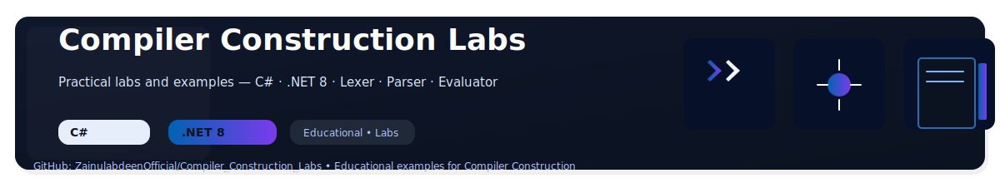
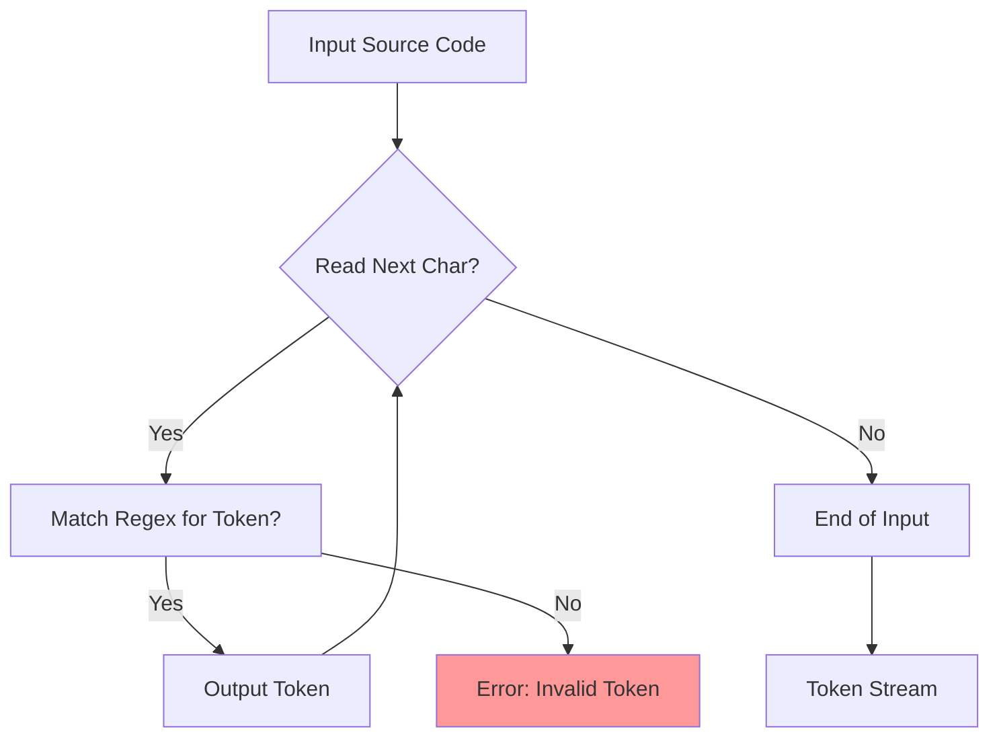
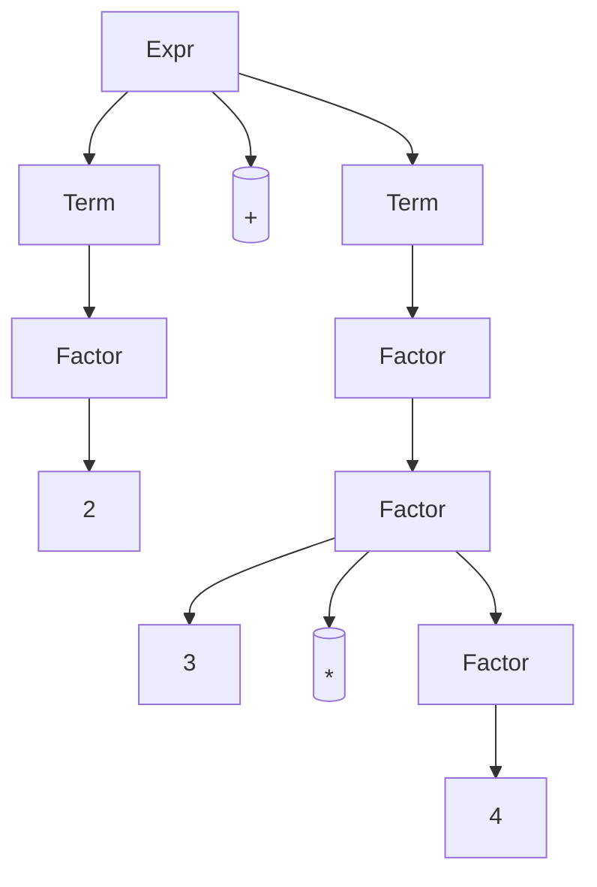
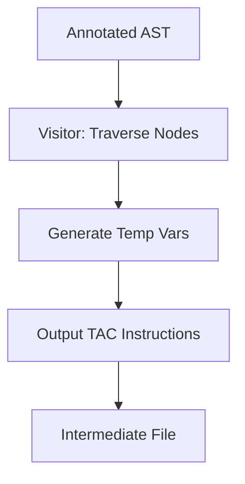

[](https://github.com/ZainulabdeenOfficial/Compiler_Construction_Labs)


# Compiler Construction Labs in C#

This repository adaptation provides lab assignments and code implementations for a Compiler Construction course, rewritten in **C#**. The original Python-based labs (using PLY) are ported to C# using libraries like **Irony** for parsing (lexical and syntax analysis) or custom implementations with regular expressions and recursive descent parsers. C# offers strong typing, which is beneficial for semantic analysis and code generation phases.

Key changes:
- Use `System.Text.RegularExpressions` for lexical analysis.
- Custom parser classes for syntax analysis (no direct PLY equivalent; Irony can be used if NuGet package is allowed).
- Symbol tables via `Dictionary<string, Symbol>`.
- Intermediate code as lists of TAC instructions.
- Diagrams remain in Mermaid for visualization.

**Prerequisites**:
- .NET SDK 6.0+ or Visual Studio.
- Install Irony if using: `dotnet add package Irony`.
- Basic knowledge of compilers remains the same.

## Lab Details (C# Implementations)

### Lab 1: Lexical Analysis (Scanner)
**Objective**: Tokenize input using regex.

**Example Code** (`Lab1/Lexer.cs`):
```csharp
using System;
using System.Collections.Generic;
using System.Text.RegularExpressions;

public class Token
{
    public string Type { get; set; }
    public string Value { get; set; }
}

public class Lexer
{
    private readonly string _input;
    private int _position;
    private readonly Dictionary<string, string> _patterns = new()
    {
        { "ID", @"[a-zA-Z_][a-zA-Z0-9_]*" },
        { "NUMBER", @"\d+" },
        { "PLUS", @"\+?" },
        { "MINUS", @"-?" }
    };

    public Lexer(string input) { _input = input; }

    public List<Token> Tokenize()
    {
        var tokens = new List<Token>();
        while (_position < _input.Length)
        {
            char current = _input[_position];
            if (char.IsWhiteSpace(current)) { _position++; continue; }

            bool matched = false;
            foreach (var pattern in _patterns)
            {
                var regex = new Regex($"^{pattern.Value}");
                var match = regex.Match(_input.Substring(_position));
                if (match.Success)
                {
                    tokens.Add(new Token { Type = pattern.Key, Value = match.Value });
                    _position += match.Length;
                    matched = true;
                    break;
                }
            }
            if (!matched)
            {
                Console.WriteLine($"Illegal character '{current}'");
                _position++;
            }
        }
        return tokens;
    }
}

// Usage
var lexer = new Lexer("x = 2 + 3");
var tokens = lexer.Tokenize();
foreach (var t in tokens) Console.WriteLine($"{t.Type}: {t.Value}");
```

**Mermaid Diagram: Lexical Analysis Flow**


### Lab 3: Syntax Analysis - Recursive Descent Parser
**Objective**: Top-down parsing for expressions.

**Grammar** (Same as before).

**Example Code** (`Lab3/Parser.cs`):
```csharp
using System;
using System.Collections.Generic;

public class AstNode { /* Base for AST */ }

public class Parser
{
    private readonly List<Token> _tokens;
    private int _current = 0;

    public Parser(List<Token> tokens) { _tokens = tokens; }

    private Token Current() => _tokens[_current];
    private void Advance() { _current++; }

    public AstNode ParseExpr()
    {
        var node = ParseTerm();
        while (Current().Type is "PLUS" or "MINUS")
        {
            var op = Current().Value;
            Advance();
            var right = ParseTerm();
            node = new BinOpNode(node, op, right);
        }
        return node;
    }

    // Similar for ParseTerm, ParseFactor...
}

// Define BinOpNode, NumberNode, etc.
```

**Mermaid Diagram: Parse Tree for 2+3*4**


### Lab 5: Semantic Analysis
**Objective**: Type checking on AST.

**Example Code Snippet** (`Lab5/SemanticAnalyzer.cs`):
```csharp
using System.Collections.Generic;

public class Symbol { public string Type { get; set; } }

public class SemanticAnalyzer
{
    private readonly Dictionary<string, Symbol> _symbolTable = new();

    public void Analyze(AstNode node)
    {
        // Visitor pattern: Check types, add to symbol table
        if (node is IdNode id)
        {
            if (!_symbolTable.ContainsKey(id.Name))
                throw new Exception("Undeclared variable");
        }
        // Handle binops: Ensure types match
    }
}
```

### Lab 7: Intermediate Code Generation
**TAC Example** (Generated as List<string>):
```csharp
public class CodeGenerator
{
    private List<string> _tac = new();
    private int _tempCount = 0;

    public void Generate(AstNode node)
    {
        if (node is BinOpNode binop)
        {
            var leftTemp = GenerateTemp();
            Generate(binop.Left);
            var rightTemp = GenerateTemp();
            Generate(binop.Right);
            _tac.Add($"{leftTemp} = {binop.Op} {rightTemp}");
        }
    }

    private string GenerateTemp() => $"t{_tempCount++}";
}
```

**Mermaid Diagram: Code Generation Flow**


## Directory Structure
```
Compiler_Construction_Labs_CSharp/
├── README.md
├── Lab1/
│   └── Lexer.cs
├── Lab3/
│   └── Parser.cs
└── ... (Similar for other labs)
```

